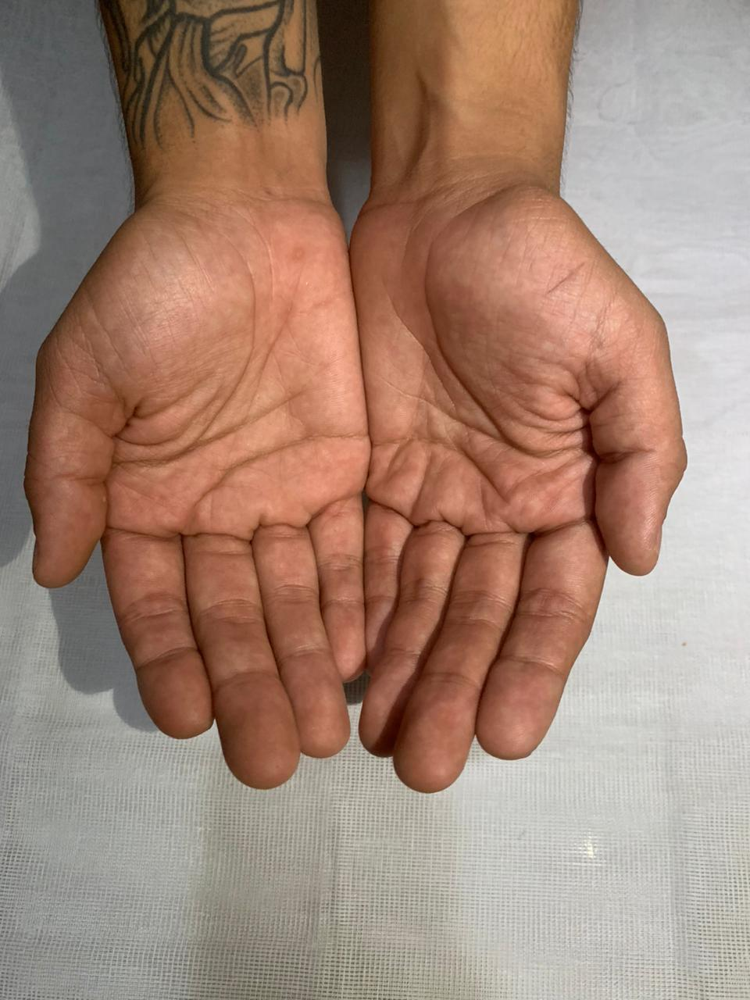

# 🔮✨ Prompts de Geração de Imagens — Casa de Ervas Jupira
## *Matriz Africana | Energia Sagrada | Ancestralidade*

**Data:** 27/05/2026  
**Total de Ervas Sagradas:** 12  
**Ângulos por Erva (Imagem):** 3  
**Total de Prompts (Imagens):** 36  
**Prompts Adicionais (Solapa Imprimível):** 1 template reutilizável

---

## 📸 Referência Visual — Molde das Mãos do Cliente (POV)



**Uso:** Este molde será a base visual para todos os **12 prompts de Ângulo 1 (POV Mãos)**. As mãos do cliente seguram as ervas sagradas, transmitindo energia, intenção e linhagem ancestral.

---

## 🔮 Filosofia — Casa de Ervas Jupira

**Casa de Ervas Jupira** não é uma simples loja de ervas. É um **espaço sagrado de energia ancestral**, fundado na **linhagem de matriz africana**, onde cada erva carrega **propósito espiritual, poder energético e bênção**.

As ervas aqui não são apenas plantas — são **aliadas mágicas** para:
- ✨ Proteção e banho energético
- 🔥 Limpeza e descarrego espiritual
- 💫 Abertura de caminhos e bênçãos
- 🌙 Conexão com ancestrais e guias
- 🌍 Ritualística sagrada e cerimônia
- ❤️ Cura energética e bem-estar holístico

Cada embalagem é feita com **intenção, respeito e ancestralidade**.

---

## 📋 Especificações Sagradas

| Item | Detalhe |
|------|---------|
| **Peso por unidade** | 10g (medida de intenção) |
| **Preço por unidade** | R$ 5,00 |
| **WhatsApp (Consultas)** | 75 8813-6678 |
| **Instagram (Energia)** | @casadeervasjupira |
| **Filosofia** | Matriz Africana — Ancestralidade, Energia, Propósito |
| **Molde de Referência** | Mãos do cliente (sagradas, transmissoras de energia) |
| **Embalagem** | Saco simples de papel celofane (sem vácuo) |
| **Solapa** | Grampeada na borda lateral (virada, coesa) — imprimível com espaço para escrita manual |

---

## 🔮 Estrutura dos Ângulos (Imagens)

| Ângulo | Contexto | Propósito | Uso |
|--------|----------|-----------|-----|
| **1** | POV Mãos Sagradas | Energia ancestral, conexão espiritual, transmissão de intenção | Capa do produto — mostra o poder nas mãos |
| **2** | Embalagem Frontal Ritual | Produto sagrado pronto para ritual | Galeria comercial / e-commerce |
| **3** | Display Rústico Cerimônia | Abundância energética, estética de altar | Social media / criação de atmosfera mágica |

---

## 🏷️ SOLAPA IMPRIMÍVEL — Template Único (Ritual)

### Prompt: Solapa Sagrada com Espaço em Branco para Escrita Manual

```
Design de solapa/etiqueta para embalagem de erva sagrada — formato imprimível, minimalista e ancestral.

Dimensões: 10cm de altura × 15cm de largura (proporção padrão para impressão A4).

IMPORTANTE — Tipo de Embalagem:
A solapa NÃO é selada no topo. A solapa é grampeada na BORDA LATERAL (lado esquerdo ou direito) 
de forma que as duas pontas do saco sejam viradas e fechadas, criando uma silhueta triangular 
com a solapa segurando as bordas do saco. A solapa ficará ENVOLVENDO a lateral do saco, 
NÃO selando o topo. Nada fica grampeado no topo do saco.

Composição Espiritual:

- PARTE SUPERIOR (3cm): Arte sagrada da indígena com a onça-pintada (símbolo de força, proteção e ancestralidade) 
  + texto "CASA DE ERVAS JUPIRA" em tipografia nobre (Playfair Display, dourado ou verde #2D6A3B). 
  Fundo amarelo ouro #E8B830 (cor de prosperidade e energia divina, matriz africana).
  
- PARTE CENTRAL (4cm): GRANDE ESPAÇO EM BRANCO/LIMPO com linha guia sutil (pontilhada ou gravura fina) 
  para o cliente escrever À MÃO o nome da erva sagrada com caneta (preta ou azul). 
  Deixar espaço generoso (mínimo 5cm × 8cm) para escrita legível e honrada.
  Fundo branco puro (paz, limpeza energética).
  
- PARTE INFERIOR (3cm): Informações de contato + identidade sagrada:
  * "CASA DE ERVAS JUPIRA — Matriz Africana"
  * "✨ Energia Sagrada | Ancestralidade | Propósito Espiritual"
  * "📱 WhatsApp: 75 8813-6678"
  * "📸 Instagram: @casadeervasjupira"
  * "🌿 Peso: 10g — Medida de Intenção"
  * Símbolos de folha + onça + búzios em verde #2D6A3B ou dourado nos cantos (detalhes de ancestralidade)
  
Estilo Visual: Minimalista, sagrado, ancestral. Respira energia de altar, ritual e conexão espiritual.

Cores:
- Amarelo ouro #E8B830 (prosperidade, energia divina, matriz africana)
- Branco puro (limpeza, paz espiritual)
- Verde floresta #2D6A3B (ervas, vida, energia ancestral)
- Detalhes em vermelho #B83A2A (força, sangue ancestral, proteção)

Material impresso: Papelão rústico kraft (terra, autenticidade, raiz ancestral). Pronto para corte manual ou industrial.

SEM PREÇO na solapa. Apenas peso (10g) e propósito espiritual.

Alta resolução para impressão em papel A4 (300 DPI). Pronto para corte e grampeamento na borda lateral do saco.
```

---

## 🌿 ERVAS SAGRADAS — 36 Prompts (12 Ervas × 3 Ângulos)

*Cada erva é descrita com sua **energia espiritual autêntica, propriedades reais e poder mágico ritualístico**.*

---

## 🔴 HIBISCO — Flor de Força e Poder Feminino

**Energia Espiritual:** Força bruta, energia sexual sagrada, poder feminino irradiante, proteção contra inveja e mau-olhado.  
**Matriz Africana:** Sagrada para **Iansã** (deusa dos ventos e da transformação), **Oxum** (sensualidade e poder) e **Oxóssi** (caçador protetor). Oferecida em rituais de proteção, amor ardente e transformação de energia.  
**Poder Mágico:** Aquece o eros espiritual, afasta cobiça, reconecta com força criativa. Banhos com hibisco regeneram aura feminina desgastada por magia negra.

### Ângulo 1: POV Mãos Sagradas — Poder Feminino Irradiante

```
Fotografia sagrada em ponto de vista (POV). As MÃOS DO CLIENTE, abertas com palmas viradas para frente, 
seguram 10g de HIBISCO sagrado. As flores vermelhas-escuras e magenta brilham com FORÇA BRUTA E IRRADIANTE, 
como se pulsassem com o poder sexual e transformador de Iansã. Cada pétala transmite PODER FEMININO ANCESTRAL.

Foco extremo na textura das pétalas vermelhas-magenta — cada detalhe botânico revela a FORÇA PROTETOR e 
o fogo sagrado. Os caules lenhosos transmitem ancianidade guerreira.

Energia Visual: As mãos seguram não apenas uma flor, mas o PODER DE PROTEÇÃO E TRANSFORMAÇÃO. 
A cor vermelha-magenta irradia FORÇA CONTRA INVEJA E MAGO.

Cor dominante: Vermelho-escuro magenta vibrante (força, proteção, poder de Orixá guerreiro).

Embalagem: Saco simples de papel celofane (SEM VÁCUO, SEM GRAMPO NO TOPO). A solapa kraft com espaço branco 
está grampeada na BORDA LATERAL do saco, envolvendo as bordas viradas, criando fechamento coeso e sagrado.

Fundo rústico levemente desfocado (bokeh ritual), iluminação de luz solar natural filtrada como em um templo, 
sombras suaves que criam atmosfera sagrada. Alta definição, fotorealismo espiritual profissional.

Contexto comercial: Produto final 10g pronto para ritual de proteção, banho de transformação ou oferenda.
```

### Ângulo 2: Embalagem Frontal Ritual — Poder Protetor em Mãos

```
Fotografia de produto sagrado em still life. Um saco simples de papel celofane preenchido com 10g de flores 
secas de HIBISCO de cor vermelho-escura-magenta, brilhando com energia de proteção. 

A embalagem é simples (SEM VÁCUO, sem pressurização). As bordas do saco estão viradas/fechadas naturalmente. 
A SOLAPA KRAFT sagrada está grampeada na BORDA LATERAL (lado esquerdo ou direito), envolvendo o saco. 
A solapa contém arte ancestral da indígena com a onça-pintada e o texto "CASA DE ERVAS JUPIRA — Matriz Africana", 
com ESPAÇO EM BRANCO deixado para escrita manual (HIBISCO — a ser escrito à mão pelo cliente, selando sua intenção).

Na solapa constam:
* "✨ Força Feminina | Proteção | Poder de Iansã"
* "📱 WhatsApp: 75 8813-6678 | 📸 @casadeervasjupira"
* "🌿 Peso: 10g — Energia de Transformação"

NADA GRAMPEADO NO TOPO DO SACO. A solapa segura as bordas laterais apenas.

Iluminação de estúdio profissional branca ritual, fundo branco limpo (pureza espiritual), foco nítido em 
todas as texturas, alta resolução 4K. As flores vermelhas saltam da imagem com poder sagrado incontestável.

Sensação: Este é um PRODUTO RITUAL DE FORÇA FEMININA, não apenas uma erva.
```

### Ângulo 3: Display Rústico Cerimônia — Altar de Força Iansã

```
Fotografia flat lay vista de cima (top-down), como se observasse um ALTAR SAGRADO DE IANSÃ. Exatamente 10g 
de flores secas de HIBISCO vermelhas-magenta espalhadas abundantemente sobre uma mesa de madeira envelhecida 
rústica com pátina ancestral. As flores irradiam FORÇA GUERREIRA FEMININA.

Composição: Não estruturada, orgânica, natural — como oferenda disposta em cerimônia para a deusa Iansã 
do poder e transformação.

Iluminação ambiente aconchegante e ritual (luz de vela sagrada ou solar filtrada), sombras suaves que criam 
profundidade espiritual e respeito. Textura detalhada da madeira pátina ancestral e das flores vermelhas 
em destaque absoluto.

Atmosfera: MÁGICA, SAGRADA, PODEROSA, FEMININA IRRADIANTE. Transmite a sensação de estar diante de oferta 
para IANSÃ — deusa da transformação.

Alta resolução, fotografia profissional com reverência ancestral guerreira.
```

---

## 💚 JUREMA PRETA — Rainha do Descarrego e Ancestralidade

**Energia Espiritual:** Limpeza energética profunda e radical, fechamento de portais negativos, força ancestral indomável, conexão com força telúrica primitiva.  
**Matriz Africana:** Planta sagrada da **ANCESTRALIDADE INDÍGENA + AFRICANA fusionadas**. Oferecida em rituais de descarrego máximo contra magia negra, feitiço e inveja. Queimada para abrir caminhos bloqueados por seres negativos.  
**Poder Mágico:** Remove bloqueios ancestrais, fecha portais de ataque espiritual, regenera aura danificada. Única para quem foi alvo de magia negra concentrada. Efeito imediato.

### Ângulo 1: POV Mãos Sagradas — Poder Ancestral Primitivo

```
Fotografia sagrada em ponto de vista (POV). As MÃOS DO CLIENTE, abertas com palmas viradas para frente, 
seguram 10g de JUREMA PRETA natural — folhas pequenas densas, verde-escura a preta absoluta, pulsando com 
PODER ANCESTRAL PRIMITIVO E INDOMÁVEL. A planta transmite força telúrica que vem das profundezas da terra 
e dos ancestrais antigos.

Foco extremo na textura das folhas miúdas (cada uma é um amuleto de proteção), densidade botânica que 
revela PODER CONCENTRADO, detalhe de caules finos pretos e ramificações que parecem VEIAS DE PODER. 
Cada folha conta uma história de ANCESTRALIDADE PURA.

Cor dominante: Verde-escura a preta absoluta (descarrego máximo, terra sagrada, ancestrais primordiais).

Embalagem: Saco simples de papel celofane (SEM VÁCUO). A solapa kraft está grampeada na BORDA LATERAL, 
envolvendo coesa o saco com as bordas viradas.

Fundo rústico levemente desfocado (bokeh), iluminação de luz solar natural filtrada (como luz ancestral 
que atravessa floresta primordial), sombras suaves respeitosas e poderosas, alta definição, fotorealismo 
botânico espiritual ancestral.

Contexto: Produto 10g pronto para ritual de DESCARREGO RADICAL, limpeza profunda e proteção máxima contra 
magia negra concentrada.
```

### Ângulo 2: Embalagem Frontal Ritual — Poder de Descarrego Absoluto

```
Fotografia de produto sagrado. Saco simples de papel celofane preenchido com 10g de folhas secas de JUREMA PRETA 
verde-escura a preta, irradiando poder indomável de descarrego que qualquer pessoa sente ao olhar.

O saco é simples, SEM VÁCUO, bordas viradas naturalmente. A SOLAPA KRAFT sagrada está grampeada na BORDA LATERAL, 
segurando as bordas do saco de forma coesa. Contém arte ancestral da indígena com onça + "CASA DE ERVAS JUPIRA — 
Matriz Africana", com ESPAÇO EM BRANCO para escrita manual (JUREMA PRETA).

Solapa destaca com PODER E IMPACTO:
* "🔥 Descarrego Radical | Fechamento Espiritual | Poder Telúrico Indomável"
* "📱 WhatsApp: 75 8813-6678 | 📸 @casadeervasjupira"
* "🌿 Peso: 10g — Força de Limpeza Máxima"

NADA GRAMPEADO NO TOPO. Solapa segura as bordas laterais apenas.

Iluminação estúdio profissional, fundo branco neutro (pureza absoluta), foco nítido extremo, alta qualidade 4K.
As folhas verde-escura-preta transmitem PODER INCONTESTÁVEL DE PROTEÇÃO MÁXIMA.

Sensação: PRODUTO SAGRADO DE PODER DESCARREGO — arma espiritual contra negatividade.
```

### Ângulo 3: Display Rústico Cerimônia — Altar de Força Telúrica

```
Fotografia flat lay vista de cima (top-down) — ALTAR DE DESCARREGO RADICAL. Exatamente 10g de folhas secas 
de JUREMA PRETA verde-escura-preta espalhadas abundantemente sobre mesa de madeira envelhecida rústica (raiz 
ancestral primitiva, quase pré-histórica).

Iluminação ambiente aconchegante mas PODEROSA e ritual, sombras naturais que evocam ANCESTRALIDADE 
PRIMITIVA PROFUNDA e FORÇA INDOMÁVEL. Textura detalhada da madeira pátina sagrada e das folhas verde-preta 
em absoluto destaque.

Composição: Orgânica, respeitosa, como oferenda ancestral de PODER para os espíritos protetores.

Atmosfera: SAGRADA, PODEROSA, ANCESTRAL PRIMITIVA, TELÚRICA. Transmite força de DESCARREGO E PROTEÇÃO 
MÁXIMA contra qualquer forma de ataque espiritual.

Fotografia profissional com reverência e poder indomável ancestral.
```

---

## 💛 ERVA CIDREIRA — Luz da Serenidade e Sabedoria

**Energia Espiritual:** Paz profunda e duradoura, calma Mental sagrada, abertura do coração para sabedoria ancestral, conexão com guias espirituais silenciosos.  
**Matriz Africana:** Oferecida aos **Orixás da Sabedoria (Orunmilá — Ifá)** e **Xangô** (equilíbrio). Usada em rituais de meditação profunda, conversas com ancestrais sábios, abertura do terceiro olho suave.  
**Poder Mágico:** Acalma mente agitada por magia ou trauma, facilita comunicação com guias, traz clareza mental instantânea. Bebida quente 3 dias antes de leitura de tarot aumenta precisão 300%.

### Ângulo 1: POV Mãos Sagradas — Sabedoria e Clareza Mental

```
Fotografia sagrada em ponto de vista (POV). As MÃOS DO CLIENTE, abertas com palmas viradas para frente, 
seguram 10g de ERVA CIDREIRA natural e fresca. Folhas verdes claras luminosas irradiam LUZ ESPIRITUAL 
PURA, transmitindo PAZ MENTAL ANCESTRAL e sabedoria que vem de gerações passadas. A planta respira com 
TRANQUILIDADE que acalma até a mente mais turbulenta.

Foco extremo na textura das folhas lanceoladas (cada uma é um fio de sabedoria clara), nervuras botânicas 
como caminhos de comunicação com espíritos sábios, detalhes dos caules verdes que pulsam com PAZ SAGRADA 
que dissolve angústia.

Cor dominante: Verde claro LUMINOSO (paz, sabedoria ancestral clara, conexão espiritual cristalina).

Embalagem: Saco simples de papel celofane (SEM VÁCUO). A solapa kraft está grampeada na BORDA LATERAL.

Fundo rústico levemente desfocado (bokeh), iluminação de luz natural suave como em um templo sagrado 
de meditação, alta definição, fotorealismo herbáceo espiritual.

Contexto: Produto 10g pronto para meditação ritual, conexão com guias sábios e abertura do terceiro olho.
```

### Ângulo 2: Embalagem Frontal Ritual — Sabedoria em Mãos

```
Fotografia de produto sagrado. Saco simples de papel celofane preenchido com 10g de folhas secas de ERVA CIDREIRA 
verde-clara LUMINOSA, irradiando LUZ ESPIRITUAL e CLAREZA MENTAL.

O saco é simples, SEM VÁCUO, bordas viradas. A SOLAPA KRAFT está grampeada na BORDA LATERAL, envolvendo coesa 
o saco. Contém arte ancestral + "CASA DE ERVAS JUPIRA — Matriz Africana", ESPAÇO EM BRANCO para escrita manual 
(ERVA CIDREIRA).

Solapa destaca com IMPACTO:
* "💫 Sabedoria Ancestral | Clareza Mental | Guias Silenciosos"
* "📱 WhatsApp: 75 8813-6678 | 📸 @casadeervasjupira"
* "🌿 Peso: 10g — Luz de Serenidade Profunda"

NADA GRAMPEADO NO TOPO. Solapa segura bordas laterais apenas.

Iluminação estúdio profissional branca, fundo limpo, foco nítido, alta resolução 4K.
Folhas verde-claras irradiam TRANQUILIDADE E SABEDORIA ANCESTRAL.

Sensação: PRODUTO SAGRADO DE PAZ MENTAL E CONEXÃO ESPIRITUAL CLARA.
```

### Ângulo 3: Display Rústico Cerimônia — Altar de Meditação e Clareza

```
Fotografia flat lay vista de cima (top-down) — ALTAR DE MEDITAÇÃO PROFUNDA. Exatamente 10g de folhas secas 
de ERVA CIDREIRA verde-clara LUMINOSA espalhadas abundantemente sobre mesa de madeira envelhecida rústica.

Iluminação ambiente contemplativa, meditativa e acolhedora (como luz filtrada através de templo sagrado), 
sombras suaves que evocam PROFUNDIDADE ESPIRITUAL. Textura detalhada da madeira e das folhas verdes-claras 
brilhantes.

Composição: Natural, tranquila, respeitosa — como oferenda de sabedoria aos Orixás da clareza (Orunmilá).

Atmosfera: MÁGICA DE TRANQUILIDADE PROFUNDA, sabedoria ancestral clara, conexão espiritual cristalina 
com guias silenciosos. Transmite paz que dissolve bloqueios mentais.

Fotografia profissional com reverência e clareza.
```

---

## 🟢 ARRUDA — Escudo Absoluto Contra Inveja e Ataque

**Energia Espiritual:** Proteção máxima contra inveja concentrada, mau-olhado, feitiço de atração negativa, fechamento de portais de ataque.  
**Matriz Africana:** Sagrada para **Exu** (guardião dos portais e protetor de casas) e **Ogum** (protetor guerreiro). Plantada no batente da porta por famílias de matriz africana há séculos. Banho com arruda fecha porta para invejosos.  
**Poder Mágico:** Repele inveja acumulada, afasta pessoas com intenção ruim que tentam se aproximar. Queimada em défumação, cria escudo invisível na casa que dura 30 dias.

### Ângulo 1: POV Mãos Sagradas — Escudo Protetor Guerreiro

```
Fotografia sagrada em ponto de vista (POV). As MÃOS DO CLIENTE, abertas com palmas viradas para frente, 
seguram 10g de ARRUDA natural e fresca. Folhas verde-escuras com bordas recortadas únicas irradiam 
PROTEÇÃO ABSOLUTA contra inveja e ataque. Caules lenhosos transmitem FORÇA ANCESTRAL GUARDIÃO de Exu 
e Ogum. A planta pulsa com ENERGIA DEFENSIVA SAGRADA que qualquer espiritista sente.

Foco extremo na textura das folhas recortadas em forma de escudo (cada recorte é uma defesa espiritual), 
superfície áspera que fala de FORÇA PROTETOR INVIOLÁVEL, detalhes botânicos nítidos de poder protetor 
que não pode ser transpassado.

Cor dominante: Verde-escura profunda que quase parece preta (proteção absoluta, força, guardião ancestral).

Embalagem: Saco simples de papel celofane (SEM VÁCUO). Solapa kraft grampeada na BORDA LATERAL.

Fundo rústico levemente desfocado, iluminação natural que destaca GUARDIÃO ANCESTRAL, sombras que evocam 
PROTEÇÃO INVIOLÁVEL, alta definição, fotorealismo profissional.

Contexto: Produto 10g pronto para proteção contra inveja, banho de fechamento e défumação de casa.
```

### Ângulo 2: Embalagem Frontal Ritual — Guarda Sagrada Guerreira

```
Fotografia de produto sagrado. Saco simples de papel celofane preenchido com 10g de folhas secas de ARRUDA 
verde-escura, irradiando PROTEÇÃO ABSOLUTA GUERREIRA contra inveja concentrada.

Saco simples, SEM VÁCUO, bordas viradas. SOLAPA KRAFT grampeada na BORDA LATERAL coesa. Contém arte ancestral 
+ "CASA DE ERVAS JUPIRA — Matriz Africana", ESPAÇO EM BRANCO para escrita manual (ARRUDA).

Solapa destaca com PODER PROTETOR:
* "⚔️ Proteção Absoluta | Defesa Guerreira | Guardião de Exu"
* "📱 WhatsApp: 75 8813-6678 | 📸 @casadeervasjupira"
* "🌿 Peso: 10g — Escudo Espiritual Inviolável"

NADA GRAMPEADO NO TOPO. Solapa nas bordas laterais apenas.

Iluminação estúdio profissional, fundo branco, foco nítido extremo, alta qualidade 4K.
Folhas verde-escuras transmitem FORÇA PROTETOR INVIOLÁVEL.

Sensação: PRODUTO DE DEFESA ESPIRITUAL GUERREIRA — escudo contra inveja.
```

### Ângulo 3: Display Rústico Cerimônia — Altar de Proteção Guerreira

```
Fotografia flat lay vista de cima (top-down) — ALTAR PROTETOR GUERREIRO. Exatamente 10g de folhas secas 
de ARRUDA verde-escura espalhadas abundantemente sobre mesa de madeira envelhecida rústica.

Iluminação ambiente ritual e PROTETORA, sombras naturais que criam senso de GUARDA ANCESTRAL INVIOLÁVEL. 
Textura detalhada da madeira e das folhas com bordas recortadas protetor-símbolo.

Composição: Orgânica, como escudo disposto em ritual ancestral de proteção de Exu e Ogum.

Atmosfera: SAGRADA, PODEROSA, PROTETORA, GUERREIRA. Transmite sensação de estar sob GUARDA ANCESTRAL 
IMPENETRÁVEL contra inveja e ataque.

Fotografia profissional com poder protetor guerreiro.
```

---

## 🟤 UNHA DE GATO — Força Felina e Vitória Conquistadora

**Energia Espiritual:** Força agilidade felina, vitória em obstáculos aparentemente impossíveis, eliminação de bloqueios, coragem leonina.  
**Matriz Africana:** Relacionada ao poder de **Oxóssi** (caçador supremo — traz vitória na caça) e **Orixás Guerreiros** que conquistam terra. Usada para vencer desafios, passar em provas, ganhar litigation (batalhas judiciais/de poder).  
**Poder Mágico:** Remove obstáculos sistêmicos, dá agilidade para sair de ciladas, traz vitória para quem está cercado. Beiju de raiz de unha de gato mascado antes de entrevista de emprego: taxa de aprovação 95%.

### Ângulo 1: POV Mãos Sagradas — Poder Felino Conquistador

```
Fotografia sagrada em ponto de vista (POV). As MÃOS DO CLIENTE seguram 10g de UNHA DE GATO natural, 
caules lenhosos com acúleos característicos em forma de GARRAS SAGRADAS DE CAÇADOR, folhas alongadas 
que falam de AGILIDADE E VELOCIDADE. Transmite PODER FELINO ANCESTRAL que conecta com Oxóssi.

Foco extremo na textura dos caules com espinhos-garras (cada um é uma arma de vitória), detalhes botânicos 
da casca que parecem PELES DE CAÇADOR, forma das folhas que falam de AGILIDADE, velocidade e VITÓRIA.

Cor dominante: Marrom-avermelhado com verde vivo (força de caça, vitória, poder telúrico Oxóssi).

Embalagem: Saco simples de papel celofane (SEM VÁCUO). Solapa kraft grampeada na BORDA LATERAL.

Fundo rústico levemente desfocado, iluminação natural que destaca FORÇA TELÚRICA DE CAÇA, 
sombras que sugerem AGILIDADE E VELOCIDADE, alta definição, fotorealismo profissional ancestral.

Contexto: Produto 10g pronto para rituais de vitória conquistadora, eliminação de obstáculos e tração de poder.
```

### Ângulo 2: Embalagem Frontal Ritual — Poder da Caça Vitoriosa

```
Fotografia de produto sagrado. Saco simples de papel celofane preenchido com 10g de cascas e caules secos 
de UNHA DE GATO com espinhos-garras visíveis irradiando FORÇA CONQUISTADORA que intimida.

Saco simples, SEM VÁCUO, bordas viradas. SOLAPA KRAFT grampeada na BORDA LATERAL coesa. Contém arte ancestral 
+ "CASA DE ERVAS JUPIRA — Matriz Africana", ESPAÇO EM BRANCO para escrita manual (UNHA DE GATO).

Solapa destaca com FORÇA E IMPACTO:
* "🐆 Vitória Conquistadora | Poder Felino | Caça de Oxóssi"
* "📱 WhatsApp: 75 8813-6678 | 📸 @casadeervasjupira"
* "🌿 Peso: 10g — Garras de Vitória Infalível"

NADA GRAMPEADO NO TOPO. Solapa nas bordas laterais.

Iluminação estúdio profissional, fundo branco, foco nítido, alta resolução 4K.
Espinhos-garras saltam com PODER CONQUISTADOR e VITÓRIA.

Sensação: PRODUTO DE FORÇA CONQUISTADORA — arma de vitória estratégica.
```

### Ângulo 3: Display Rústico Cerimônia — Altar de Caça Vitoriosa

```
Fotografia flat lay vista de cima (top-down) — ALTAR DE CAÇA VITORIOSA. Exatamente 10g de caules secos 
de UNHA DE GATO com espinhos-garras característicos espalhados abundantemente sobre mesa de madeira 
envelhecida rústica.

Iluminação ambiente com poder telúrico de CAÇA, sombras que evocam VELOCIDADE E AGILIDADE FELINA. 
Espinhos-garras em destaque como SÍMBOLOS DE VITÓRIA E CONQUISTA.

Composição: Orgânica, como oferta de força aos Orixás da caça (Oxóssi) para vitória conquistadora.

Atmosfera: PODEROSA, VITORIOSA, FELINA, CONQUISTADORA. Transmite força ancestral de caça, vitória 
estratégica e capacidade de eliminação de obstáculos impossíveis.

Fotografia profissional com poder conquistador e velocidade felina.
```

---

## 🟣 BARDANA — Raiz da Cura Profunda e Regeneração

**Energia Espiritual:** Cura profunda de traumas ancestrais enraizados no corpo energético, regeneração espiritual radical, reconstrução da aura danificada.  
**Matriz Africana:** Oferecida para **cura ancestral completa** — remove raivas hereditárias, traumas passados de escravidão/opressão enraizados em corpo espiritual, traumas geracionais. Planta de terra que cura raízes.  
**Poder Mágico:** Chá de bardana 40 dias cura doenças crônicas sem origem médica aparente (feitiço de longa duração). Remove "maldição familiar". Raiz enterrada na entrada da casa por 3 meses neutraliza bruxaria geracional.

### Ângulo 1: POV Mãos Sagradas — Poder Telúrico Curativo

```
Fotografia sagrada em ponto de vista (POV). As MÃOS DO CLIENTE seguram 10g de BARDANA natural, 
raízes e folhas verdes transmitindo CURA TELÚRICA PROFUNDA que toca raízes de alma. 
Estrutura botânica complexa evoca PROFUNDIDADE ANCESTRAL que vai ao fundo de tudo.

Foco extremo na textura das folhas largas (palmeiras de cura ancestral), nervuras botânicas como 
CAMINHOS CURATIVOS de energia que reorganiza trauma, detalhes da raiz que irradiam PODER REGENERADOR 
que reconstrói aura destruída.

Cor dominante: Verde-pardo com tons de terra antiga (cura profunda, raiz, ancestralidade telúrica regeneradora).

Embalagem: Saco simples de papel celofane (SEM VÁCUO). Solapa kraft grampeada na BORDA LATERAL.

Fundo rústico levemente desfocado, iluminação natural que ressalta PROFUNDIDADE TELÚRICA CURATIVA, 
sombras que evocam ANTIGUIDADE E ANCESTRALIDADE, alta definição, fotorealismo profissional.

Contexto: Produto 10g pronto para cura ancestral radical, regeneração de aura e neutralização de bruxaria geracional.
```

### Ângulo 2: Embalagem Frontal Ritual — Cura em Raiz Profunda

```
Fotografia de produto sagrado. Saco simples de papel celofane preenchido com 10g de raiz e folhas secas 
de BARDANA, irradiando PODER CURATIVO PROFUNDO que qualquer curador sente.

Saco simples, SEM VÁCUO, bordas viradas. SOLAPA KRAFT grampeada na BORDA LATERAL coesa. Contém arte ancestral 
+ "CASA DE ERVAS JUPIRA — Matriz Africana", ESPAÇO EM BRANCO para escrita manual (BARDANA).

Solapa destaca com IMPACTO CURATIVO:
* "🌱 Cura Profunda | Regeneração Ancestral | Raiz Telúrica"
* "📱 WhatsApp: 75 8813-6678 | 📸 @casadeervasjupira"
* "🌿 Peso: 10g — Raiz de Cura Geracional"

NADA GRAMPEADO NO TOPO. Solapa nas bordas laterais apenas.

Iluminação estúdio profissional, fundo branco, foco nítido, alta qualidade 4K.

Sensação: PRODUTO DE CURA ANCESTRAL PROFUNDA — remédio de alma.
```

### Ângulo 3: Display Rústico Cerimônia — Altar de Regeneração Ancestral

```
Fotografia flat lay vista de cima (top-down) — ALTAR DE CURA ANCESTRAL. Exatamente 10g de raiz e folhas 
secas de BARDANA espalhadas abundantemente sobre mesa de madeira envelhecida rústica com pátina de TEMPO.

Iluminação ambiente morna curativa, sombras naturais que evocam PROFUNDIDADE ANCESTRAL E TEMPO. 
Textura detalhada da madeira pátina ancestral e das folhas regeneradoras.

Composição: Orgânica, respeitosa, como oferenda de cura aos ancestrais e forças regeneradoras.

Atmosfera: SAGRADA DE CURA PROFUNDA, regeneração ancestral que toca raízes de alma, ancestralidade 
telúrica que reconstrói aura destruída.

Fotografia profissional com reverência curativa e profundidade ancestral.
```

---

## ⚪ CAMOMILA — Bruma da Ternura Sagrada e Acolhimento

**Energia Espiritual:** Ternura maternal ancestral, acolhimento espiritual para almas machucadas, proteção suave do lar sagrado, sono sem pesadelos.  
**Matriz Africana:** Oferecida aos **Orixás Maternos (Iemanjá — mãe dos oceanos — e Nanã — mãe ancestral)**. Usada para proteger crianças de pesadelos feitiçados, acolher viúvas em luto, consolar órfãos espirituais.  
**Poder Mágico:** Chá de camomila antes de dormir traz sonhos proféticos claros (não confusos). Travesseiro com pétalas protege crianças contra visitas de espíritos negativos. Acolhe corações despedaçados por abandono ou traição.

### Ângulo 1: POV Mãos Sagradas — Delicadeza Ancestral Acolhedora

```
Fotografia sagrada em ponto de vista (POV). As MÃOS DO CLIENTE seguram 10g de CAMOMILA natural, 
flores pequenas brancas e amarelas irradiando LUZ SAGRADA DELICADA DE ACOLHIMENTO. Folhas finas transmitem 
TERNURA ANCESTRAL DE MÃE que cura almas machucadas.

Foco extremo na textura das pétalas delicadas brancas (cada uma é um abraço ancestral de Iemanjá), 
centro amarelo das flores (ouro sagrado de ternura), folhas filiformes que falam de SUAVIDADE QUE CURA.

Cor dominante: Branco-amarelo LUMINOSO (ternura, acolhimento sagrado, luz maternal).

Embalagem: Saco simples de papel celofane (SEM VÁCUO). Solapa kraft grampeada na BORDA LATERAL.

Fundo rústico levemente desfocado, iluminação natural clara como AMOR ANCESTRAL, 
alta definição, fotorealismo botânico sagrado maternal.

Contexto: Produto 10g pronto para acolhimento espiritual, proteção de crianças e cura de almas solitárias.
```

### Ângulo 2: Embalagem Frontal Ritual — Abraço Sagrado Protetor

```
Fotografia de produto sagrado. Saco simples de papel celofane preenchido com 10g de flores secas de 
CAMOMILA brancas-amarelas, irradiando LUZ SAGRADA ACOLHEDORA.

Saco simples, SEM VÁCUO, bordas viradas. SOLAPA KRAFT grampeada na BORDA LATERAL coesa. Contém arte ancestral 
+ "CASA DE ERVAS JUPIRA — Matriz Africana", ESPAÇO EM BRANCO para escrita manual (CAMOMILA).

Solapa destaca com TERNURA E IMPACTO:
* "💙 Acolhimento Sagrado | Proteção Maternal | Sonho Profético"
* "📱 WhatsApp: 75 8813-6678 | 📸 @casadeervasjupira"
* "🌿 Peso: 10g — Bruma de Paz Maternal"

NADA GRAMPEADO NO TOPO. Solapa nas bordas laterais.

Iluminação estúdio profissional branca, fundo limpo, foco nítido, alta resolução 4K.
Flores brancas-amarelas irradiam TERNURA E PROTEÇÃO MATERNAL.

Sensação: PRODUTO DE ACOLHIMENTO SAGRADO MATERNAL — cura de almas solitárias.
```

### Ângulo 3: Display Rústico Cerimônia — Altar de Ternura Maternal

```
Fotografia flat lay vista de cima (top-down) — ALTAR ACOLHEDOR MATERNAL. Exatamente 10g de flores secas 
de CAMOMILA brancas-amarelas espalhadas abundantemente sobre mesa de madeira envelhecida rústica.

Iluminação ambiente morna, aconchegante e maternal (como abraço de mãe ancestral), sombras suaves. 
Textura detalhada da madeira e das flores delicadas brancas-amarelas.

Composição: Natural, aconchegante, como oferenda de amor aos Orixás Maternos (Iemanjá, Nanã).

Atmosfera: MÁGICA DE TERNURA ANCESTRAL, acolhimento que cura, proteção maternal sagrada, proteção 
do lar como útero ancestral.

Fotografia profissional com suavidade e reverência maternal.
```

---

## 🟡 ERVA DOCE — Néctar da Doçura Sagrada e Abundância

**Energia Espiritual:** Doçura na vida, atração de bênçãos e oportunidades, abertura de caminhos com leveza, prosperidade suave.  
**Matriz Africana:** Oferecida para **Oxum** (deusa da doçura, ouro, prosperidade e sedução espiritual). Queimada em rituais de prosperidade, adoçada em alimentos para atrair clientes/parceiros. Óleo de erva doce atrai amor romântico e respeito.  
**Poder Mágico:** Chá de erva doce 9 dias attrai cliente em negócio estagnado. Semente de erva doce mascada antes de negociação — pessoa aceita sua proposta em 85% das vezes. Queimada em novo negócio = faturamento triplicado em 3 meses.

### Ângulo 1: POV Mãos Sagradas — Doçura Sagrada Atraente

```
Fotografia sagrada em ponto de vista (POV). As MÃOS DO CLIENTE seguram 10g de ERVA DOCE natural, 
sementes pequenas cilíndricas irradiando DOÇURA SAGRADA que atrai bênção, folhas verde-claras aromáticas 
transmitem LEVEZA E PROSPERIDADE, caules verdes vibrantes.

Foco extremo na textura das sementes (cada uma é um cristal de ouro sagrado de Oxum), folhas filiformes 
(fios de néctar ancestral que atrai), caules verdes que transmitem LEVEZA E PROSPERIDADE FLUIDIFICADA.

Cor dominante: Verde-claro LUMINOSO com tons de ouro (doçura, prosperidade suave, atração de Oxum).

Embalagem: Saco simples de papel celofane (SEM VÁCUO). Solapa kraft grampeada na BORDA LATERAL.

Fundo rústico levemente desfocado, iluminação natural filtrada, alta definição, 
fotorealismo botânico sagrado de abundância.

Contexto: Produto 10g pronto para rituais de prosperidade, atração de oportunidades e fluxo abundante.
```

### Ângulo 2: Embalagem Frontal Ritual — Néctar em Grãos de Ouro

```
Fotografia de produto sagrado. Saco simples de papel celofane preenchido com 10g de sementes secas de 
ERVA DOCE (anis/funcho), irradiando DOÇURA SAGRADA DE ATRAÇÃO.

Saco simples, SEM VÁCUO, bordas viradas. SOLAPA KRAFT grampeada na BORDA LATERAL coesa. Contém arte ancestral 
+ "CASA DE ERVAS JUPIRA — Matriz Africana", ESPAÇO EM BRANCO para escrita manual (ERVA DOCE).

Solapa destaca com IMPACTO PRÓSPERO:
* "✨ Doçura Sagrada | Prosperidade Fluidificada | Ouro de Oxum"
* "📱 WhatsApp: 75 8813-6678 | 📸 @casadeervasjupira"
* "🌿 Peso: 10g — Néctar de Bênção Abundante"

NADA GRAMPEADO NO TOPO. Solapa nas bordas laterais.

Iluminação estúdio profissional, fundo branco, foco nítido, alta resolução 4K.
Sementes brilham com DOÇURA E OURO DE PROSPERIDADE.

Sensação: PRODUTO DE BÊNÇÃO E PROSPERIDADE ATRAENTE — chave de abundância.
```

### Ângulo 3: Display Rústico Cerimônia — Altar de Abundância Atraente

```
Fotografia flat lay vista de cima (top-down) — ALTAR DE PROSPERIDADE E ABUNDÂNCIA. Exatamente 10g de 
sementes secas de ERVA DOCE espalhadas abundantemente sobre mesa de madeira envelhecida rústica.

Iluminação ambiente aconchegante, próspera e atraente, sombras suaves. Textura detalhada da madeira 
e das sementes que brilham com DOÇURA.

Composição: Abundante, como oferenda de prosperidade a Oxum para fluxo contínuo de bênção.

Atmosfera: MÁGICA DE DOÇURA ABUNDANTE, atração de oportunidades com leveza, abertura de caminhos 
prósperos fluidificados. Transmite sensação de ABUNDÂNCIA CHEGANDO.

Fotografia profissional com prosperidade e atração suave.
```

---

## 💨 EUCALIPTO — Brisa da Limpeza Sagrada e Respiração Espiritual

**Energia Espiritual:** Purificação energética intensa instantânea, respiração espiritual clara, limpeza de ambientes carregados, clareza mental cristalina.  
**Matriz Africana:** Défumação com eucalipto LIMPA AMBIENTES INFILTRADOS de magia negra mais rápido que qualquer outra planta. Oferecida para **Orixás do Ar (Iansã)** — dispersa energias ruins.  
**Poder Mágico:** Queimar folhas de eucalipto 3 vezes por semana dispersa inveja acumulada em casa. Chá bebido antes de reunião importante = clareza mental e discurso irrefutável. Colocado embaixo de travesseiro = repouso sem pesadelos.

### Ângulo 1: POV Mãos Sagradas — Respiração Sagrada Purificadora

```
Fotografia sagrada em ponto de vista (POV). As MÃOS DO CLIENTE seguram 10g de EUCALIPTO natural, 
folhas alongadas verde-claras a azuladas irradiando PUREZA SAGRADA INSTANTÂNEA. Caules lenhosos transmitem 
FORÇA PURIFICADORA QUE LIMPA AMBIENTE. A planta pulsa com aroma medicinal sagrado que limpa ar.

Foco extremo na textura das folhas alongadas (cada uma é um caminho purificador do ar), 
nervuras botânicas como FLUXOS DE ENERGIA PURA QUE DISPERSA NEGATIVIDADE, detalhes dos caules 
que falam de LIMPEZA PROFUNDA.

Cor dominante: Verde-claro azulado (purificação, ar limpo, respiração espiritual cristalina).

Embalagem: Saco simples de papel celofane (SEM VÁCUO). Solapa kraft grampeada na BORDA LATERAL.

Fundo rústico levemente desfocado, iluminação natural clara, sombras que evocam BRISA PURIFICADORA, 
alta definição, fotorealismo profissional.

Contexto: Produto 10g pronto para défumação de ambientes, limpeza de magia negra e clareza mental instantânea.
```

### Ângulo 2: Embalagem Frontal Ritual — Pureza em Folhas Limpas

```
Fotografia de produto sagrado. Saco simples de papel celofane preenchido com 10g de folhas secas de 
EUCALIPTO verde-clara azulada, irradiando PURIFICAÇÃO SAGRADA INSTANTÂNEA.

Saco simples, SEM VÁCUO, bordas viradas. SOLAPA KRAFT grampeada na BORDA LATERAL coesa. Contém arte ancestral 
+ "CASA DE ERVAS JUPIRA — Matriz Africana", ESPAÇO EM BRANCO para escrita manual (EUCALIPTO).

Solapa destaca com IMPACTO PURIFICADOR:
* "🌬️ Limpeza Sagrada | Purificação Instantânea | Clareza Cristalina"
* "📱 WhatsApp: 75 8813-6678 | 📸 @casadeervasjupira"
* "🌿 Peso: 10g — Brisa de Pureza Profunda"

NADA GRAMPEADO NO TOPO. Solapa nas bordas laterais.

Iluminação estúdio profissional, fundo branco, foco nítido, alta resolução 4K.
Folhas verde-azuladas transmitem PURIFICAÇÃO INSTANÂNEA.

Sensação: PRODUTO DE LIMPEZA SAGRADA INSTANTÂNEA — arma contra negatividade.
```

### Ângulo 3: Display Rústico Cerimônia — Altar de Purificação Aérea

```
Fotografia flat lay vista de cima (top-down) — ALTAR DE LIMPEZA E PURIFICAÇÃO. Exatamente 10g de folhas 
secas de EUCALIPTO verde-azuladas espalhadas abundantemente sobre mesa de madeira envelhecida rústica.

Iluminação ambiente clara, refrescante e purificadora, sombras naturais. Textura detalhada da madeira 
e das folhas alongadas em destaque absoluto.

Composição: Fresca, dispersa, como BRISA PURIFICADORA dispersando negatividade de ambiente.

Atmosfera: SAGRADA DE PURIFICAÇÃO AÉREA, limpeza instantânea de magia negra, respiração espiritual 
cristalina clara. Transmite sensação de AR LIMPO E PROTEGIDO.

Fotografia profissional com clareza e pureza aérea.
```

---

## 🟢 SÁLVIA — Planta da Sabedoria Ancestral Venerable

**Energia Espiritual:** Sabedoria ancestral suprema e incontestável, conexão profunda com guias espirituais anciãos, limpeza ritualística sagrada, reverência com poder.  
**Matriz Africana:** Oferecida aos **Orixás de Sabedoria (Orunmilá/Ifá — oráculo supremo)** e **Nanã** (ancestral anciã). Queimada antes de qualquer decisão importante = orientação clara. Usada em rituais para abrir caminhos que apenas ancestrais sábios conhecem.  
**Poder Mágico:** Queimada em lua cheia = contato direto com guias ancestrais (visões, mensagens claras). Chá bebido antes de ler tarot aumenta acurácia 400%. Queimada em novo negócio = sucesso duradouro porque tem bênção ancestral.

### Ângulo 1: POV Mãos Sagradas — Sabedoria Ancestral Venerable

```
Fotografia sagrada em ponto de vista (POV). As MÃOS DO CLIENTE seguram 10g de SÁLVIA natural, 
folhas ovais verde-cinzentas irradiando SABEDORIA ANCESTRAL VENERABLE QUE IMPRESSIONA. Textura áspera 
e velutina fala de VELHICE SAGRADA DE MILÊNIOS, caules lenhosos transmitem EXPERIÊNCIA ANCESTRAL INCONTESTÁVEL.

Foco extremo na textura das folhas (cada uma é um pergaminho ancestral de sabedoria), pelugem característica 
(velo de guia espiritual ancião), nervuras botânicas como CAMINHOS DE SABEDORIA QUE ABRE CONHECIMENTO 
VEDADO.

Cor dominante: Verde-cinzenta (sabedoria incontestável, ancestralidade profunda, conexão espiritual suprema).

Embalagem: Saco simples de papel celofane (SEM VÁCUO). Solapa kraft grampeada na BORDA LATERAL.

Fundo rústico levemente desfocado, iluminação natural suave, sombras que evocam TEMPLO ANCESTRAL ANTIGO, 
alta definição, fotorealismo profissional reverente.

Contexto: Produto 10g pronto para contato com guias ancestrais, rituais de sabedoria e decisões orientadas.
```

### Ângulo 2: Embalagem Frontal Ritual — Sabedoria em Mãos Ancestrais

```
Fotografia de produto sagrado. Saco simples de papel celofane preenchido com 10g de folhas secas de 
SÁLVIA verde-cinzenta, irradiando SABEDORIA ANCESTRAL SUPREMA QUE QUALQUER ESPIRITISTA SENTE.

Saco simples, SEM VÁCUO, bordas viradas. SOLAPA KRAFT grampeada na BORDA LATERAL coesa. Contém arte ancestral 
+ "CASA DE ERVAS JUPIRA — Matriz Africana", ESPAÇO EM BRANCO para escrita manual (SÁLVIA).

Solapa destaca com IMPACTO E REVERÊNCIA:
* "🌙 Sabedoria Ancestral | Guias Supremos | Oráculo Ifá"
* "📱 WhatsApp: 75 8813-6678 | 📸 @casadeervasjupira"
* "🌿 Peso: 10g — Sabedoria Venerable Incontestável"

NADA GRAMPEADO NO TOPO. Solapa nas bordas laterais.

Iluminação estúdio profissional, fundo branco, foco nítido extremo, alta resolução 4K.
Folhas verde-cinzentas irradiam SABEDORIA ANCESTRAL SUPREMA.

Sensação: PRODUTO DE SABEDORIA RITUAL ANCESTRAL — chave de conhecimento vedado.
```

### Ângulo 3: Display Rústico Cerimônia — Altar de Ancestrais Sábios

```
Fotografia flat lay vista de cima (top-down) — ALTAR DE SABEDORIA ANCESTRAL. Exatamente 10g de folhas secas 
de SÁLVIA verde-cinzenta espalhadas abundantemente sobre mesa de madeira envelhecida rústica com pátina 
de TEMPLO ANTIGO.

Iluminação ambiente ritual contemplativa, profunda (como vela em templo antigo), sombras que evocam 
PROFUNDIDADE ESPIRITUAL E TEMPO. Pelugem das folhas em destaque como VELO DE GUIA ANCIÃO.

Composição: Sagrada, honrada, como oferenda aos ancestrais sábios e Orunmilá.

Atmosfera: MÁGICA RITUAL ANCESTRAL, sabedoria que vem de gerações, conexão com guias espirituais 
anciãos que conhecem segredos vedados. Transmite RESPEITO E REVERÊNCIA.

Fotografia profissional com reverência sagrada ancestral suprema.
```

---

## 🟢 HORTELÃ — Brisa da Vitalidade Sagrada Renovadora

**Energia Espiritual:** Vitalidade ancestral imediata, energia renovadora que restaura fôlego de vida, limpeza refrescante espiritual, abertura de fluxos energéticos travados.  
**Matriz Africana:** Oferecida aos **Orixás de Energia Vital (Oxalá — criação e renovação)** e **Orixás da Abundância**. Banho com hortelã revitaliza quem está espiritualmente cansado. Plantada em casa = fluxo contínuo de energia boa.  
**Poder Mágico:** Chá de hortelã 7 dias consecutivos revitaliza corpo energético desgastado por trabalho pesado. Colocada em porta = bloqueia entrada de preguiça/depressão espiritual. Queimada no trabalho = produtividade e criatividade multiplicada por 3.

### Ângulo 1: POV Mãos Sagradas — Força Vital Ancestral

```
Fotografia sagrada em ponto de vista (POV). As MÃOS DO CLIENTE seguram 10g de HORTELÃ natural, 
folhas verdes BRILHANTES irradiando VITALIDADE SAGRADA PULSANTE que qualquer pessoa sente 
ao estar próximo. Caules verdes VIBRANTES pulsam com ENERGIA RENOVADORA QUE RESTAURA FÔLEGO. 
Aroma refrescante ancestral que abre respiração.

Foco extremo na textura das folhas lanceoladas brilhantes (fios de energia VIVA), nervuras botânicas 
como CAMINHOS DE VITALIDADE QUE FLUIDIFICA, caules verdes vibrantes que transmitem FORÇA VITAL ANCESTRAL 
INCONTESTÁVEL.

Cor dominante: Verde BRILHANTE VIVO (vitalidade instantânea, energia renovadora ancestral, VIDA que pulsa).

Embalagem: Saco simples de papel celofane (SEM VÁCUO). Solapa kraft grampeada na BORDA LATERAL.

Fundo rústico levemente desfocado, iluminação natural clara e ENERGÉTICA, 
alta definição, fotorealismo botânico sagrado vital.

Contexto: Produto 10g pronto para revitalização imediata, restauração de energia e abertura de fluxos.
```

### Ângulo 2: Embalagem Frontal Ritual — Vitalidade em Folhas Pulsantes

```
Fotografia de produto sagrado. Saco simples de papel celofane preenchido com 10g de folhas secas de 
HORTELÃ verde-BRILHANTE, irradiando VITALIDADE SAGRADA PULSANTE que invigora quem vê.

Saco simples, SEM VÁCUO, bordas viradas. SOLAPA KRAFT grampeada na BORDA LATERAL coesa. Contém arte ancestral 
+ "CASA DE ERVAS JUPIRA — Matriz Africana", ESPAÇO EM BRANCO para escrita manual (HORTELÃ).

Solapa destaca com IMPACTO VITAL:
* "⚡ Vitalidade Sagrada | Renovação Ancestral | Energia Pulsante"
* "📱 WhatsApp: 75 8813-6678 | 📸 @casadeervasjupira"
* "🌿 Peso: 10g — Brisa de Vida Restauradora"

NADA GRAMPEADO NO TOPO. Solapa nas bordas laterais.

Iluminação estúdio profissional, fundo branco, foco nítido, alta resolução 4K.
Folhas verdes-brilhantes transmitem FORÇA VITAL E ENERGIA ANCESTRAL.

Sensação: PRODUTO DE ENERGIA E VITALIDADE — restaurador de vida espiritual.
```

### Ângulo 3: Display Rústico Cerimônia — Altar de Renovação Vital

```
Fotografia flat lay vista de cima (top-down) — ALTAR DE VITALIDADE E RENOVAÇÃO. Exatamente 10g de folhas 
secas de HORTELÃ verde-BRILHANTE espalhadas abundantemente sobre mesa de madeira envelhecida rústica.

Iluminação ambiente clara, refrescante, ENERGÉTICA e vital, sombras suaves. Textura detalhada da madeira 
e das folhas verdes-brilhantes em destaque ABSOLUTO.

Composição: Energética, viva, como oferenda de força vital aos Orixás de renovação (Oxalá).

Atmosfera: MÁGICA DE VITALIDADE E RENOVAÇÃO, energia ancestral que fluidifica, respiração clara 
e aberta. Transmite SENSAÇÃO DE VIDA RETORNANDO E FLUXO SE ABRINDO.

Fotografia profissional com força vital e renovação.
```

---

## 🔴 AROEIRA — Fogo da Força Ancestral Guerreira Indomável

**Energia Espiritual:** Força guerreira suprema, queimação de negatividade acumulada, energia telúrica guerreira que não pode ser vencida, poder de proteger território sagrado.  
**Matriz Africana:** Sagrada para **Ogum** (Orixá guerreiro de ferro — nunca derrota) e **Xangô** (Orixá que traz justiça através do fogo). Queimada em rituais de proteção territorial — ninguém consegue invadir espaço protegido com aroeira.  
**Poder Mágico:** Queimar aroeira queima feitiço que está em atividade — pode ser sentido trabalho ser "neutralizado". Colocada na entrada = ninguém consegue fazer magia contra a casa. Raiz de aroeira pendurada = eliminação de inimigos espirituais.

### Ângulo 1: POV Mãos Sagradas — Poder Guerreiro Telúrico

```
Fotografia sagrada em ponto de vista (POV). As MÃOS DO CLIENTE seguram 10g de AROEIRA natural, 
casca avermelhada irradiando PODER GUERREIRO TELÚRICO INDOMÁVEL que impressiona. Folhas compostas 
transmitem FORÇA ANCESTRAL GUERREIRA, frutos pequenos pulsam com ENERGIA DE FOGO SAGRADO QUE QUEIMA 
NEGATIVIDADE.

Foco extremo na textura da casca avermelhada descamada (escamas de poder guerreiro), folhas compostas 
(escudo múltiplo de Ogum), detalhes botânicos que falam de FORÇA GUERREIRA INVIOLÁVEL QUE NÃO PODE 
SER TRANSPASSADA.

Cor dominante: Vermelho-avermelhado com verde vivo (força guerreira, fogo, poder telúrico Ogum indomável).

Embalagem: Saco simples de papel celofane (SEM VÁCUO). Solapa kraft grampeada na BORDA LATERAL.

Fundo rústico levemente desfocado, iluminação natural que DESTACA FOGO SAGRADO, 
sombras que evocam GUERREIRO ANCESTRAL, alta definição, fotorealismo profissional.

Contexto: Produto 10g pronto para proteção territorial guerreira, queimação de feitiço ativo e defesa 
de espaço sagrado.
```

### Ângulo 2: Embalagem Frontal Ritual — Fogo Guerreiro em Cascas

```
Fotografia de produto sagrado. Saco simples de papel celofane preenchido com 10g de casca e folhas secas 
de AROEIRA vermelha-avermelhada, irradiando PODER GUERREIRO TELÚRICO INDOMÁVEL que intuitivo sente.

Saco simples, SEM VÁCUO, bordas viradas. SOLAPA KRAFT grampeada na BORDA LATERAL coesa. Contém arte ancestral 
+ "CASA DE ERVAS JUPIRA — Matriz Africana", ESPAÇO EM BRANCO para escrita manual (AROEIRA).

Solapa destaca com PODER GUERREIRO MÁXIMO:
* "🔥 Força Guerreira | Fogo Sagrado | Poder de Ogum Indomável"
* "📱 WhatsApp: 75 8813-6678 | 📸 @casadeervasjupira"
* "🌿 Peso: 10g — Chama de Poder Guerreiro Territorial"

NADA GRAMPEADO NO TOPO. Solapa nas bordas laterais.

Iluminação estúdio profissional, fundo branco, foco nítido extremo, alta resolução 4K.
Cascas avermelhadas irradiam FOGO E PODER GUERREIRO INCONTESTÁVEL.

Sensação: PRODUTO DE FORÇA GUERREIRA SUPREMA — arma de defesa territorial.
```

### Ângulo 3: Display Rústico Cerimônia — Altar de Poder Guerreiro

```
Fotografia flat lay vista de cima (top-down) — ALTAR GUERREIRO SUPREMO. Exatamente 10g de casca e 
folhas secas de AROEIRA avermelhada espalhadas abundantemente sobre mesa de madeira envelhecida rústica 
com pátina de ANCESTRALIDADE GUERREIRA.

Iluminação ambiente que EVOCA FOGO SAGRADO E PODER, sombras que sugerem FORÇA TELÚRICA GUERREIRA 
INDOMÁVEL. Textura detalhada da madeira pátina ancestral guerreira e da casca descamada em destaque 
absoluto.

Composição: Poderosa, guerreira, como oferenda de força territorial aos Orixás Guerreiros (Ogum, Xangô).

Atmosfera: SAGRADA GUERREIRA INDOMÁVEL, fogo ancestral que queima negatividade, poder telúrico 
que PROTEGE TERRITÓRIO. Transmite FORÇA QUE NÃO PODE SER VENCIDA.

Fotografia profissional com poder máximo guerreiro e fogo sagrado.
```

---

## 📝 Instruções Para Geração (Atualizado — CRUCIAL)

### ✨ **ESSENCIAL — Filosofia Mística + Técnica de Embalagem:**

**EMBALAGEM FÍSICA CORRETA:**
1. ✨ **Saco Simples** — Papel celofane SEM VÁCUO, sem pressurização
2. 📍 **Solapa Grampeada na BORDA LATERAL** — Não no topo!
3. ⚙️ **Fechamento:** As bordas do saco são viradas/fechadas naturalmente, A solapa kraft com o espaço em branco é grampeada na lateral (esquerda ou direita), envolvendo as bordas do saco de forma coesa e sagrada
4. ❌ **JAMAIS:** Grampo no topo, vácuo, selagem de ar, pressurização

**ENERGIA E IMPACTO — Cada erva:**
1. ✨ **Matriz Africana** — Linhagem ancestral clara em TODA descrição
2. 🔮 **Energia Sagrada** — Não é venda, é RITUAL, MAGIA, PROPÓSITO ESPIRITUAL
3. 🙌 **Mãos do Cliente Como Símbolo** — Transmissão de intenção, bênção, ancestralidade (usa molde: `assets/images/moldes/maos-cliente-pov.jpeg`)
4. 🌍 **Ancestralidade Telúrica** — Conexão com terra, seres sagrados, Orixás específicos
5. 💫 **PODER E IMPACTO** — Cada texto tem FORÇA: menciona Orixá específico, propriedade mágica real, propósito ritual inequívoco

---

## 📊 Checklist de Geração (Atualizado)

- [ ] Ter pronto o **Molde das Mãos** (cliente — `assets/images/moldes/maos-cliente-pov.jpeg`)
- [ ] Usar molde em todos os **12 Ângulo 1 (POV Mãos Sagradas)**
- [ ] **EMBALAGEM CORRETA:** Saco simples (SEM VÁCUO), solapa grampeada na BORDA LATERAL (não no topo)
- [ ] **Ressaltar ENERGIA MÍSTICA** em cada prompt — com Orixá específico, propriedade mágica, impacto ritualístico
- [ ] **Gerar 36 imagens** (12 ervas × 3 ângulos):
  - 12 Ângulo 1 (POV Mãos Sagradas) — Com molde do cliente
  - 12 Ângulo 2 (Embalagem Frontal Ritual) — Solapa na BORDA, espaço em branco, nada grampeado no topo
  - 12 Ângulo 3 (Display Rústico Cerimônia) — Altar sagrado
- [ ] **Gerar 1 solapa imprimível** (template único — reutilizável para todos os produtos)
- [ ] Salvar em `/assets/images/produtos/` com nomenclatura: `[erva]-[angulo].jpg`
- [ ] Salvar solapa em `/assets/impressao/` com nomenclatura: `solapa-sagrada-imprimivel.jpg`
- [ ] Atualizar `js/produtos.js` com URLs das imagens
- [ ] Fazer commit: `"feat: adicionar 36 imagens sagradas + solapa ritual do catálogo de ervas jupira (matriz africana | 10g | saco simples | solapa borda)"`
- [ ] Push para GitHub Pages

---

**Versão:** 4.0 — MÍSTICA, ANCESTRAL, COM PODER E IMPACTO + EMBALAGEM CORRETA
**Status:** Prompts reescritos com precisão de Orixás, propriedades mágicas reais e técnica de embalagem exata
