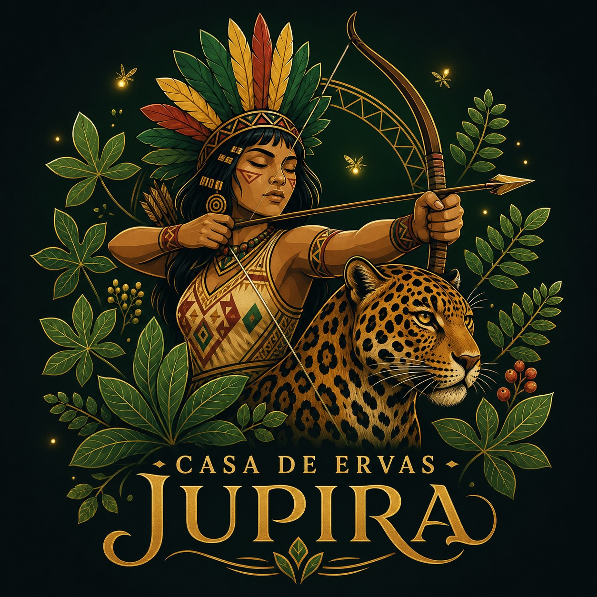
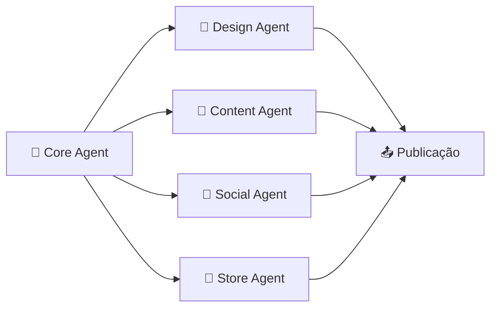

<p align="center">
  
</p>

<h1 align="center">🌿 Casa de Ervas Jupira</h1>

<p align="center">
  <strong>Ervas, design e espiritualidade — uma casa com alma de cabocla.</strong>
  <br />
  <code>@casadeervasjupira</code> &nbsp;·&nbsp; <code>Okê Jupira! 🙏</code>
</p>

<p align="center">
  <a href="https://github.com/Deivisan/casa-de-ervas-jupira"></a>
  <a href="https://deivisan.github.io/casa-de-ervas-jupira"></a>
  <a href="https://wa.me/557588136678"></a>
  <a href="https://instagram.com/casadeervasjupira"></a>
</p>

---

## 🏹 Sobre

A **Casa de Ervas Jupira** é um ecossistema criativo que une o conhecimento ancestral das plantas à potência do design contemporâneo. Cada produto, cada post e cada pixel carrega a força da mata e o frescor das folhas — inspirados pela **Cabocla Jupira**, princesa das matas, guerreira flecheira, filha de Jurema.

### O que entregamos

| Frente              | Descrição                                                                 |
|---------------------|---------------------------------------------------------------------------|
| 📸 **Instagram**    | Posts, stories e reels com identidade visual cabocla e paleta amarelo-verde-vermelho |
| 🎨 **Geração de Imagens** | 36 prompts estratégicos para IA (Midjourney/DALL-E) com 12 ervas × 3 ângulos |
| 🌱 **Casa de Ervas** | Loja online com banhos, defumações, incensos, velas e Kits Jupira        |
| 🛒 **Site Completo** | Catálogo, página da Cabocla Jupira, checkout com saudação Okê Jupira      |
| 🤖 **Agentes IA**   | 4 agentes autônomos orquestrados para design, conteúdo, redes e loja      |
| 📝 **Conteúdo**     | Mínimo 10 posts iniciais + notebook-lm para automação criativa           |

---

## 🎨 Identidade Visual

A marca é construída sobre as **cores da Cabocla Jupira**:

```color
🟡 Amarelo  #E8B830 — Cor principal (coroa de Jurema, luz, girassol)
🟢 Verde    #2D6A3B — Mata, ervas frescas, Oxóssi
🔴 Vermelho #B83A2A — Fogo de Iansã, força, guerra
🔵 Azul Anil #2A4B7C — Espiritualidade, profundidade, Jacutá
```

| Elemento     | Detalhe                                          |
|--------------|--------------------------------------------------|
| **Logotipo** | Cabocla indígena com penacho (símbolo + texto)   |
| **Tipografia** | Playfair Display (títulos) + Inter (corpo)     |
| **Tom de Voz** | Firme e poético — como uma cabocla que fala pouco mas acolhe |
| **Saudação** | Okê Jupira! 🙏                                    |

---

## 📂 Estrutura do Projeto

```
casa-de-ervas-jupira/
│
│   🏠 SITE (GitHub Pages — estático)
├── 📄 index.html                  # Home — hero, destaques, sobre Jupira
├── 📄 produtos.html               # Catálogo completo com filtros (29 produtos)
├── 📄 velas.html                  # Velas aromáticas (10 produtos reais)
├── 📄 defumadores.html            # Defumadores genéricos (1 produto)
├── 📄 ervas.html                  # Ervas secas (12 produtos reais)
├── 📄 kits.html                   # Kits espirituais (arquivo legado)
├── 📄 acessorios.html             # Acessórios espirituais (5 produtos reais)
├── 📄 produto.html                # Página dinâmica de cada produto
├── 📄 sobre.html                  # História completa da Cabocla Jupira
├── 📄 contato.html                # WhatsApp, Instagram, mensagens rápidas
├── 📄 .nojekyll                   # Otimização GH Pages
├── 📁 css/
│   └── 📄 style.css               # Estilo completo (cores cabocla)
├── 📁 js/
│   ├── 📄 produtos.js             # Catálogo com 29 produtos reais
│   ├── 📄 cart.js                 # Carrinho + WhatsApp integration
│   └── 📄 main.js                 # Navegação, filtros, renderização
├── 📁 assets/
│   ├── 📄 jupira.jpeg             # Logotipo oficial RPA
│   ├── 📁 drive-originals/        # 11 fotos reais (velas + acessórios)
│   └── 📁 images/
│       └── 📁 produtos/           # 36 imagens geradas (12 ervas × 3 ângulos)
│
│   📚 DOCUMENTAÇÃO DO PROJETO
├── 📄 README.md                   # → Você está aqui (Roadmap + Status)
├── 📄 agentes.md                  # Orquestração dos 4 agentes IA + Geração de imagens
├── 📄 PROMPTS-GERACAO-IMAGENS.md  # 36 prompts prontos para IA (12 ervas × 3 ângulos)
├── 📄 RESUMO-EXECUTIVO.txt        # Overview comercial do projeto
├── 📁 src/
│   ├── 📁 design/                 # Identidade visual completa
│   │   ├── 📄 skill-map.md        #   Mapa de habilidades
│   │   ├── 📄 brand-guidelines.md #   Diretrizes da marca cabocla
│   │   ├── 📄 color-palette.md    #   Paleta amarelo-verde-vermelho-anil
│   │   └── 📄 typography.md       #   Hierarquia tipográfica
│   ├── 📁 instagram/              # Estratégia de conteúdo (10 posts + notebook-lm)
│   │   ├── 📄 content-calendar.md #   Calendário editorial
│   │   ├── 📄 image-generation.md #   Prompts para geração de imagens
│   │   └── 📁 post-templates/
│   ├── 📁 loja/                   # E-commerce e produtos
│   │   ├── 📄 checkout-flow.md    #   Fluxo de compra
│   │   ├── 📁 ervas/
│   │   │   ├── 📄 catalog.md      #   Catálogo com preços
│   │   │   ├── 📄 categories.md   #   Categorias e tags
│   │   │   └── 📁 descricoes/
│   │   └── 📁 site/
│   │       └── 📄 structure.md    #   Sitemap
│   └── 📁 agents/                 # Agentes especializados
│       ├── 📄 design-agent.md     #   🎨 Agente de Design
│       ├── 📄 content-agent.md    #   📝 Agente de Conteúdo
│       ├── 📄 social-agent.md     #   📸 Agente Social
│       └── 📄 store-agent.md      #   🌿 Agente da Loja
├── 📁 docs/
│   ├── 📄 index.md                # Central de documentação
│   └── 📁 vision/
│       ├── 📄 manifesto.md        # Manifesto — história da Cabocla Jupira
│       └── 📄 README.md
├── 📁 templates/                  # Modelos de posts
│   ├── 📄 post-instagram.md
│   ├── 📄 story-instagram.md
│   └── 📄 product-card.md
└── 📁 config/                     # Configuração e automação
    ├── 📄 opencode.json
    └── 📁 workflows/
        ├── 📄 criar-post.md
        └── 📄 cadastrar-produto.md
```

---

## 🤖 Agentes

O ecossistema é orquestrado por **4 agentes autônomos** que trabalham em sincronia:



| Agente            | Função                                    | Documento                    |
|-------------------|-------------------------------------------|------------------------------|
| 🧠 **Core Agent**  | Orquestra todos os agentes e valida entregas | `agentes.md`                |
| 🎨 **Design Agent**| Cria e mantém a identidade visual cabocla | `src/agents/design-agent.md` |
| 📝 **Content Agent**| Escreve com tom espiritual e firme        | `src/agents/content-agent.md`|
| 📸 **Social Agent**| Gerencia Instagram, notebook-lm e métricas | `src/agents/social-agent.md` |
| 🌿 **Store Agent**  | Cuida do catálogo, estoque e pedidos      | `src/agents/store-agent.md`  |

---

## 📊 Roadmap Completo do Projeto

### ✅ **FASE 1 — Fundação (CONCLUÍDA)**

- [x] Criação do repositório GitHub
- [x] Definição de identidade visual (cores, fontes, ton de voz)
- [x] Logo oficial (Cabocla Jupira + onça-pintada)
- [x] Brand guidelines e color palette
- [x] Manifesto e história da Cabocla Jupira
- [x] Estrutura de 9 páginas HTML (home, produtos, velas, ervas, acessórios, etc.)
- [x] Sistema CSS responsivo com tema cabocla (amarelo/verde/vermelho/anil)
- [x] Catálogo com 29 produtos verificados (10 velas + 12 ervas + 5 acessórios + 1 defumador + 1 vela especial)
- [x] Fotos reais: 11 imagens drive-originals (velas + acessórios)
- [x] Integração WhatsApp no carrinho de compras
- [x] Documentação completa (README, agentes.md, RESUMO-EXECUTIVO.txt)
- [x] Deploy no GitHub Pages (site online)

---

### 🔄 **FASE 2 — Geração de Imagens (EM PROGRESSO)**

#### 2.1 Metodologia de Geração
- [x] Criação de 36 prompts padronizados (12 ervas × 3 ângulos)
- [x] Documentação: `PROMPTS-GERACAO-IMAGENS.md` (pronto)
- [x] Definição dos 3 ângulos: POV Mãos, Embalagem Frontal, Display Rústico
- [ ] Coleta de ativos base (foto das mãos do cliente + validação do logo)
- [ ] Geração das 36 imagens usando Midjourney/DALL-E/Stable Diffusion
- [ ] Upload em `/assets/images/produtos/` com nomenclatura: `[erva]-[angulo].jpg`
- [ ] Atualização automática de `js/produtos.js` com URLs das imagens
- [ ] Validação visual de qualidade e coesão estética
- [ ] Commit final: `"feat: adicionar 36 imagens do catálogo de ervas"`

---

### 📱 **FASE 3 — Marketing & Conteúdo (PRÓXIMA)**

#### 3.1 Promessa ao Cliente: **Mínimo 10 Posts Iniciais**

O cliente receberá **pelo menos 10 posts estratégicos** para lançamento do Instagram:

- [ ] **Post 1:** Apresentação da Cabocla Jupira (história + mística)
- [ ] **Post 2:** Qual erva para cada necessidade (guia rápido)
- [ ] **Post 3:** Como usar uma erva (passo a passo visual)
- [ ] **Post 4:** Produto destaque 1 (Vela Caveira Preta)
- [ ] **Post 5:** Produto destaque 2 (Arruda — proteção)
- [ ] **Post 6:** Benefícios da defumação (educacional)
- [ ] **Post 7:** Combo/Kit Jupira (promoção)
- [ ] **Post 8:** Depoimento cliente (social proof)
- [ ] **Post 9:** Dica espiritual (valor agregado)
- [ ] **Post 10:** Call-to-action geral (visite a loja)

#### 3.2 Automação com Notebook-LM
- [ ] Configuração de templates de conteúdo no Notebook-LM
- [ ] Geração de legendas automáticas (espirituais + comerciais)
- [ ] Criação de variations de posts (A/B testing)
- [ ] Agendamento de publicações (calendário editorial)
- [ ] Sugestões de hashtags por tema

#### 3.3 Estratégia de Redes Sociais
- [ ] Calendário editorial para 30 dias
- [ ] Mix de conteúdo: educacional (40%), venda (30%), engajamento (30%)
- [ ] Stories diários (bastidores, dicas, promoções)
- [ ] Reels semanais (ritual, transformação, produto)
- [ ] Planejamento de campanhas sazonais (festas, lançamentos)

---

### 🎨 **FASE 4 — Campanha Criativa Complementar**

#### 4.1 Geração de Assets Criativos (via Notebook-LM + IA)
- [ ] Banners promocionais (horizontal 1200x600)
- [ ] Cards de produtos (quadrado 1080x1080)
- [ ] Carrosséis educacionais (múltiplos slides)
- [ ] Infográficos (tipos de ervas, como usar)
- [ ] Vídeos curtos (15-30s) — rituals, teasers
- [ ] Imagens de histórias (9:16 vertical)

#### 4.2 Copywriting Espiritual
- [ ] Descrições de produtos refinadas (escrita cabocla)
- [ ] Headlines impactantes (call-to-action)
- [ ] Microcopy para botões e CTAs
- [ ] Legendas com mantras e saudações ("Okê Jupira!")
- [ ] Scripts para reels e vídeos curtos

---

### 🛒 **FASE 5 — Otimização de Conversão**

- [ ] A/B testing de imagens de produtos
- [ ] Otimização de landing page (checkout)
- [ ] Analítica de Google (tracking de conversão)
- [ ] Integração com sistema de CRM (se necessário)
- [ ] Relatório mensal de desempenho

---

### 📈 **FASE 6 — Escalabilidade**

- [ ] Expansão de linhas de produtos (novos kits)
- [ ] Parcerias com influencers espirituais
- [ ] Email marketing automático (pós-compra, recomendações)
- [ ] Programa de fidelização (loyalty)
- [ ] Possível migração para plataforma e-commerce dedicada (Shopify, WooCommerce)

---

## 🌿 Linha Especial — Cabocla Jupira

Produtos dedicados à Cabocla Jupira, preparados com ervas que remetem à sua força:

| Produto            | Itens incluídos                          | Energia            | Preço   |
|--------------------|------------------------------------------|--------------------|---------|
| Defumação Jupira   | Arruda + Alecrim + Folhas de Jurema      | Descarrego + cura  | R$ 22,00|
| Vela Jupira        | Jurema + Alfazema                        | Cura espiritual    | R$ 28,00|
| Kit Jupira         | Ervas + Vela + Defumação + Guia          | Kit completo       | R$ 62,00|

---

## 📊 Status do Projeto — Checklist Completo

### 🏗️ **INFRAESTRUTURA & SITE**
- [x] Repositório GitHub criado e configurado
- [x] GitHub Pages ativo (site online)
- [x] 9 páginas HTML completas
- [x] CSS responsivo e temático
- [x] JavaScript (carrinho, filtros, renderização dinâmica)
- [x] Integração WhatsApp (checkout → contato direto)
- [x] .nojekyll para otimização

### 🎨 **IDENTIDADE VISUAL**
- [x] Paleta de cores definida (amarelo/verde/vermelho/anil)
- [x] Tipografia escolhida (Playfair Display + Inter)
- [x] Logo oficial criado (jupira.jpeg)
- [x] Brand guidelines documentadas
- [x] Tom de voz definido (firme, poético, acolhedor)

### 📦 **CATÁLOGO DE PRODUTOS**
- [x] 29 produtos reais verificados
- [x] 10 velas (figurativas, anatômicas, coloridas)
- [x] 12 ervas (com fitoenergética + fitoterapia)
- [x] 5 acessórios (pembas, pós, guias, bonecos, abanos)
- [x] 1 defumador genérico
- [x] 1 vela especial (membro masculino)
- [x] Estrutura de dados consolidada (id, nome, categoria, energia, preço, validade, sku, badge, img, desc)

### 📸 **IMAGENS — CATÁLOGO**
- [x] 11 imagens drive-originals (reais) coletadas e otimizadas
- [x] Imagens Pexels para complemento (velas, acessórios)
- [x] Remoção de fotos mockadas/inadequadas
- [x] Nomenclatura consistente e descritiva

### 🌱 **IMAGENS — GERAÇÃO DE ERVAS**
- [x] 36 prompts criados e documentados (`PROMPTS-GERACAO-IMAGENS.md`)
- [x] 3 ângulos padronizados por erva (POV Mãos, Embalagem, Display Rústico)
- [x] Especificações botânicas detalhadas em cada prompt
- [x] Pronto para geração IA (Midjourney/DALL-E)
- [ ] **Aguardando:** Foto das mãos do cliente + validação do logo
- [ ] **Próximo:** Geração das 36 imagens

### 📚 **DOCUMENTAÇÃO**
- [x] README.md (este arquivo — roadmap + status)
- [x] agentes.md (orquestração de 4 agentes)
- [x] PROMPTS-GERACAO-IMAGENS.md (36 prompts prontos)
- [x] RESUMO-EXECUTIVO.txt (overview comercial)
- [x] Brand guidelines
- [x] Manifesto da Cabocla Jupira
- [x] Estrutura de pastas documentada

### 🤖 **AGENTES & AUTOMAÇÃO**
- [x] 4 agentes definidos (Design, Content, Social, Store)
- [x] Fluxo de orquestração documentado
- [x] Competências de cada agente mapeadas
- [x] Arquivo de agentes.md completo

### 📱 **MARKETING & CONTEÚDO**
- [ ] **10 posts iniciais planejados** (em desenvolvimento)
  - [ ] Post 1: Apresentação Cabocla Jupira
  - [ ] Post 2: Guia de ervas
  - [ ] Post 3: Tutorial de uso
  - [ ] Post 4-6: Produtos destaque
  - [ ] Post 7-10: Promoção, social proof, CTAs
- [ ] Calendário editorial (30 dias)
- [ ] Integração Notebook-LM (automação de conteúdo)
- [ ] Templates de posts (Instagram, Stories, Reels)
- [ ] Copywriting espiritual em desenvolvimento

### 📊 **ANALYTICS & OTIMIZAÇÃO**
- [ ] Google Analytics configurado
- [ ] Tracking de conversão
- [ ] A/B testing de imagens
- [ ] KPIs monitorados (CTR, conversão, engagement)

---

## 📈 Próximos Passos Imediatos

### **Semana 1 — Validação de Ativos**
1. [ ] Cliente fornece: **Foto das mãos** (palmas abertas, viradas para frente)
2. [ ] Cliente valida: **Logo oficial** (indígena + onça + "CASA DE ERVAS JUPIRA")
3. [ ] Devsan confirma qualidade dos ativos base

### **Semana 2 — Geração de Imagens**
1. [ ] Geração das 36 imagens (12 ervas × 3 ângulos)
2. [ ] Upload em `/assets/images/produtos/`
3. [ ] Atualização de `js/produtos.js` com URLs
4. [ ] Validação visual do catálogo

### **Semana 3 — Conteúdo & Marketing**
1. [ ] Criação dos 10 posts iniciais
2. [ ] Integração com Notebook-LM para automação
3. [ ] Calendário editorial para 30 dias
4. [ ] Agendamento no Instagram Business

### **Semana 4 — Lançamento**
1. [ ] Validação final do site
2. [ ] Publicação dos 10 posts
3. [ ] Ativação de campanhas promocionais
4. [ ] Monitoramento de analytics

---

## 🚀 Comece por aqui

```bash
# Clone o repositório
git clone https://github.com/Deivisan/casa-de-ervas-jupira.git

# Explore a estrutura
eza --tree -L 2 casa-de-ervas-jupira

# Leia o manifesto (história da Cabocla Jupira)
bat docs/vision/manifesto.md

# Conheça os agentes
bat agentes.md

# Veja os prompts de geração
bat PROMPTS-GERACAO-IMAGENS.md

# Veja o site (abra no navegador)
xdg-open index.html
```

---

## 🗂️ Catálogo (REAL)

**Apenas produtos verificados com imagens e descrições reais:**

| Categoria       | Qtd | Preço Mín | Preço Máx | Detalhes |
|-----------------|-----|-----------|-----------|----------|
| 🕯️ Velas        | 10  | R$ 6,00   | R$ 38,00  | Figurativas, anatômicas, coloridas |
| 🌱 Ervas        | 12  | R$ 5,00   | R$ 12,00  | Fitoenergética + fitoterapia (36 prompts prontos) |
| 🛍️ Acessórios   | 5   | R$ 15,00  | R$ 35,00  | Pembas, pós, guias, bonecos, abanos |
| 🕯️ Defumadores  | 1   | R$ 5,00   | R$ 5,00   | Conforme embalagem |
| 🌟 Vela Especial| 1   | R$ 18,00  | R$ 18,00  | Membro masculino (energia masculina) |
| **TOTAL**       | **29**| **R$ 5,00**| **R$ 38,00**| **Todos verificados** |

**Acesse:** `js/produtos.js` · **Documentação:** `agentes.md`

---

## 💬 Marketing — Compromisso com o Cliente

### ✨ **10 Posts Iniciais Garantidos**

Este é um compromisso formal: o cliente receberá **no mínimo 10 posts estratégicos** para lançamento e consolidação da marca no Instagram.

**Estrutura dos posts:**
- 4 posts educacionais (histório, guia, tutorial, benefícios)
- 3 posts de produto (destaques e promoções)
- 2 posts de engajamento (social proof, dicas espirituais)
- 1 post de call-to-action (visite a loja)

**Cronograma:** A ser agendado conforme disponibilidade do cliente para coleta de ativos (foto das mãos + validação do logo).

### 🤖 **Automação com Notebook-LM**

O cliente poderá **automatizar geração de conteúdo** usando Notebook-LM para:
- Criar variações de legendas
- Sugerir hashtags contextualizadas
- Gerar ideias de posts automáticos
- Otimizar captions com tom espiritual

---

## 🙏 Okê Jupira!

> _Jupira é a princesa das matas, guerreira que mora no Jacutá — onde a terra encontra o céu, e o design encontra a alma._

<p align="center">
  <a href="https://instagram.com/casadeervasjupira">📸 Instagram</a> &nbsp;·&nbsp;
  <a href="https://wa.me/557588136678?text=Olá! Vim pela Casa de Ervas Jupira 🌿 Okê Jupira!">📱 WhatsApp</a> &nbsp;·&nbsp;
  <a href="docs/vision/manifesto.md">📖 Manifesto</a> &nbsp;·&nbsp;
  <a href="agentes.md">🤖 Agentes</a> &nbsp;·&nbsp;
  <a href="PROMPTS-GERACAO-IMAGENS.md">📷 Prompts</a> &nbsp;·&nbsp;
  <a href="https://github.com/Deivisan/casa-de-ervas-jupira/issues">🐛 Reportar Issue</a>
</p>

---

<p align="center">
  <sub>Feito com 🌿 e 🏹 para honrar a Cabocla Jupira e manter viva a sabedoria das matas.</sub>
  <br/>
  <sub>Versão 2.0 — Com roadmap completo, 36 prompts de geração e compromisso de 10 posts iniciais.</sub>
</p>
