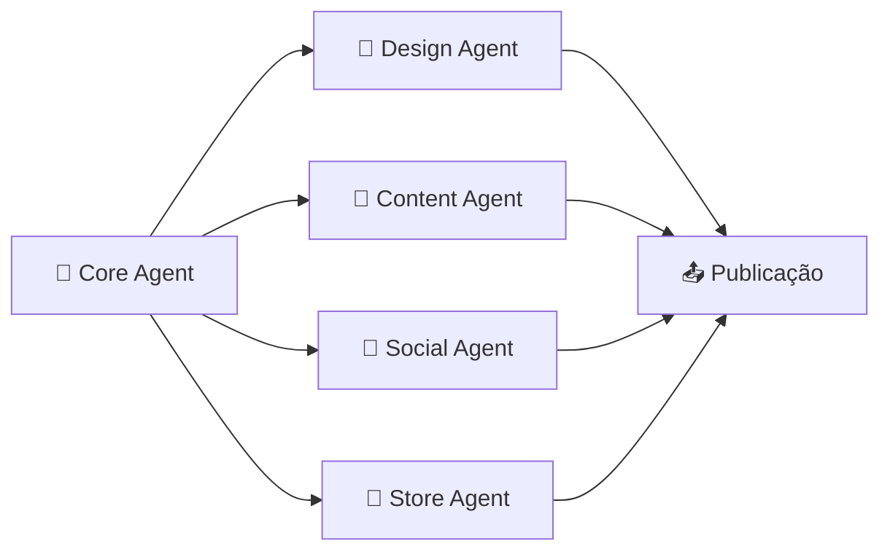

<p align="center">
  
</p>

<h1 align="center">🌿 Casa de Ervas Jupira</h1>

<p align="center">
  <strong>Ervas, design e espiritualidade — uma casa com alma de cabocla.</strong>
  <br />
  <code>@casadeervasjupira</code> &nbsp;·&nbsp; <code>Okê Jupira! 🙏</code>
</p>

<p align="center">
  <a href="https://github.com/Deivisan/casa-de-ervas-jupira"></a>
  <a href="#"></a>
  <a href="docs/vision/manifesto.md"></a>
  <a href="agentes.md"></a>
</p>

---

## 🏹 Sobre

A **Casa de Ervas Jupira** é um ecossistema criativo que une o conhecimento ancestral das plantas à potência do design contemporâneo. Cada produto, cada post e cada pixel carrega a força da mata e o frescor das folhas — inspirados pela **Cabocla Jupira**, princesa das matas, guerreira flecheira, filha de Jurema.

### O que entregamos

| Frente              | Descrição                                                                 |
|---------------------|---------------------------------------------------------------------------|
| 📸 **Instagram**    | Posts, stories e reels com identidade visual cabocla e paleta amarelo-verde-vermelho |
| 🎨 **Geração de Imagens** | Prompts estratégicos para IA (Midjourney) com tema de cabocla, ervas e mata |
| 🌱 **Casa de Ervas** | Loja online com banhos, defumações, incensos, velas e Kits Jupira        |
| 🛒 **Site Completo** | Catálogo, página da Cabocla Jupira, checkout com saudação Okê Jupira      |
| 🤖 **Agentes IA**   | 4 agentes autônomos orquestrados para design, conteúdo, redes e loja      |

---

## 🎨 Identidade Visual

A marca é construída sobre as **cores da Cabocla Jupira**:

```color
🟡 Amarelo  #E8B830 — Cor principal (coroa de Jurema, luz, girassol)
🟢 Verde    #2D6A3B — Mata, ervas frescas, Oxóssi
🔴 Vermelho #B83A2A — Fogo de Iansã, força, guerra
🔵 Azul Anil #2A4B7C — Espiritualidade, profundidade, Jacutá
```

| Elemento     | Detalhe                                          |
|--------------|--------------------------------------------------|
| **Logotipo** | Cabocla indígena com penacho (símbolo + texto)   |
| **Tipografia** | Playfair Display (títulos) + Inter (corpo)     |
| **Tom de Voz** | Firme e poético — como uma cabocla que fala pouco mas acolhe |
| **Saudação** | Okê Jupira! 🙏                                    |

---

## 📂 Estrutura do Projeto

```
casa-de-ervas-jupira/
│
├── 📄 README.md                   # → Você está aqui
├── 📄 agentes.md                  # Orquestração dos 4 agentes IA
├── 📄 .gitignore
│
├── 📁 src/
│   ├── 📁 design/                 # Identidade visual completa
│   │   ├── 📄 skill-map.md        #   Mapa de habilidades de design
│   │   ├── 📄 brand-guidelines.md #   Diretrizes da marca cabocla
│   │   ├── 📄 color-palette.md    #   Paleta amarelo-verde-vermelho-anil
│   │   └── 📄 typography.md       #   Hierarquia tipográfica
│   │
│   ├── 📁 instagram/              # Estratégia de conteúdo
│   │   ├── 📄 content-calendar.md #   Calendário editorial semanal
│   │   ├── 📄 image-generation.md #   Prompts para geração de imagens IA
│   │   └── 📁 post-templates/     #   Templates visuais (em breve)
│   │
│   ├── 📁 loja/                   # E-commerce e produtos
│   │   ├── 📄 checkout-flow.md    #   Fluxo completo de compra
│   │   ├── 📁 ervas/
│   │   │   ├── 📄 catalog.md      #   Catálogo com preços e Linha Jupira
│   │   │   ├── 📄 categories.md   #   Categorias e tags
│   │   │   └── 📁 descricoes/     #   Descrições sensoriais (em breve)
│   │   └── 📁 site/
│   │       └── 📄 structure.md    #   Sitemap e arquitetura do site
│   │
│   └── 📁 agents/                 # Agentes especializados
│       ├── 📄 design-agent.md     #   🎨 Agente de Design
│       ├── 📄 content-agent.md    #   📝 Agente de Conteúdo
│       ├── 📄 social-agent.md     #   📸 Agente Social
│       └── 📄 store-agent.md      #   🌿 Agente da Loja
│
├── 📁 docs/
│   ├── 📄 index.md                # Central de documentação
│   └── 📁 vision/
│       ├── 📄 manifesto.md        # Manifesto — história da Cabocla Jupira
│       └── 📄 README.md           # Índice da visão
│
├── 📁 templates/                  # Modelos prontos
│   ├── 📄 post-instagram.md       #   Template de post para feed
│   ├── 📄 story-instagram.md      #   Template de story interativo
│   └── 📄 product-card.md         #   Card de produto para catálogo
│
├── 📁 assets/                     # Recursos estáticos
│   ├── 📁 images/                 #   Imagens e ilustrações
│   ├── 📁 fonts/                  #   Fontes do projeto
│   └── 📁 icons/                  #   Ícones e favicon
│
└── 📁 config/                     # Configuração e automação
    ├── 📄 opencode.json           #   Configuração do ecossistema de agentes
    └── 📁 workflows/
        ├── 📄 criar-post.md       #   Workflow: criar post no Instagram
        └── 📄 cadastrar-produto.md #   Workflow: cadastrar produto na loja
```

---

## 🤖 Agentes

O ecossistema é orquestrado por **4 agentes autônomos** que trabalham em sincronia:



| Agente            | Função                                    | Documento                    |
|-------------------|-------------------------------------------|------------------------------|
| 🧠 **Core Agent**  | Orquestra todos os agentes e valida entregas | `agentes.md`                |
| 🎨 **Design Agent**| Cria e mantém a identidade visual cabocla | `src/agents/design-agent.md` |
| 📝 **Content Agent**| Escreve com tom espiritual e firme        | `src/agents/content-agent.md`|
| 📸 **Social Agent**| Gerencia Instagram e métricas             | `src/agents/social-agent.md` |
| 🌿 **Store Agent**  | Cuida do catálogo, estoque e pedidos      | `src/agents/store-agent.md`  |

---

## 🌿 Linha Especial — Cabocla Jupira

Produtos dedicados à Cabocla Jupira, preparados com ervas que remetem à sua força:

| Produto            | Itens incluídos                          | Energia            | Preço   |
|--------------------|------------------------------------------|--------------------|---------|
| Defumação Jupira   | Arruda + Alecrim + Folhas de Jurema      | Descarrego + cura  | R$ 22,00|
| Vela Jupira        | Jurema + Alfazema                        | Cura espiritual    | R$ 28,00|
| Kit Jupira         | Ervas + Vela + Defumação + Guia          | Kit completo       | R$ 62,00|

---

## 🚀 Comece por aqui

```bash
# Clone o repositório
git clone https://github.com/Deivisan/casa-de-ervas-jupira.git

# Explore a estrutura
eza --tree -L 2 casa-de-ervas-jupira

# Leia o manifesto (história da Cabocla Jupira)
bat docs/vision/manifesto.md

# Conheça os agentes
bat agentes.md

# Veja a paleta de cores
bat src/design/color-palette.md
```

---

## 📊 Status do Projeto

| Área              | Status          | Observação                       |
|-------------------|-----------------|----------------------------------|
| Identidade Visual | ✅ Estruturado  | Cores, tipografia, brand definidos |
| Instagram         | ✅ Estruturado  | Calendário e prompts prontos      |
| Loja              | ✅ Estruturado  | Catálogo, categorias, checkout    |
| Site              | ✅ Estruturado  | Sitemap e arquitetura definidos   |
| Agentes           | ✅ Estruturado  | 4 agentes documentados           |
| Assets Visuais    | ⏳ Pendente     | Aguardando logo e imagens finais  |
| Desenvolvimento   | ⏳ Pendente     | Site e automações a implementar   |

---

## 🙏 Okê Jupira!

> _Jupira é a princesa das matas, guerreira que mora no Jacutá — onde a terra encontra o céu, e o design encontra a alma._

<p align="center">
  <a href="https://instagram.com/casadeervasjupira">📸 Instagram</a> &nbsp;·&nbsp;
  <a href="docs/vision/manifesto.md">📖 Manifesto</a> &nbsp;·&nbsp;
  <a href="agentes.md">🤖 Agentes</a> &nbsp;·&nbsp;
  <a href="https://github.com/Deivisan/casa-de-ervas-jupira/issues">🐛 Reportar Issue</a>
</p>

---

<p align="center">
  <sub>Feito com 🌿 e 🏹 para honrar a Cabocla Jupira e manter viva a sabedoria das matas.</sub>
</p>
